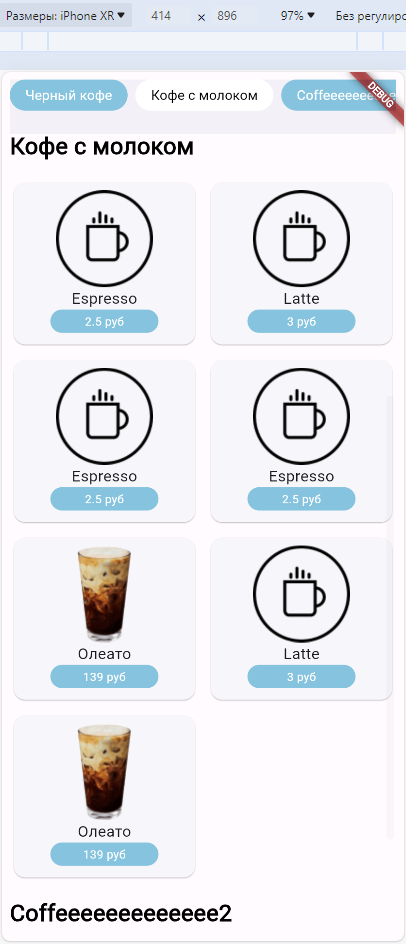
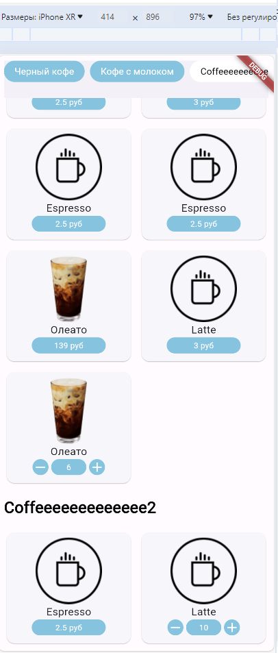

# coffee_shop

Проект созданный с помощью Flutter, представляющий собой приложение для магазина кофе. 

## Что сделано на каждом из этапов

### Этап 1

- Была сделана верстка главного экрана, содержащая сетку карточек, строку категорий.
- Была сделана кнопка, по нажатию на которую появляется возможность выбора количества товара
- Был сделан скролл до нужной категории по нажатию на CategoryChips
- Если картинка не найдена на устройстве в ассетах, то вставляется заглушка

<u>Я открыт к любым советам и критике и постараюсь подправить недочеты. Также хотелось бы услышать советы по структуре проекта и по DTO, поскольку не сильно разбираюсь в этой теме.</u>

Ниже будут перечислены пункты, которые были еще **не сделаны в работе**. По ним я хотел юы по возможности услышать советы по реализации.
- [ ] Скролл Row с CategoryChips в зависимости от категории на экране. ~~Нашел видеоролик, где завязывались на высоту контейнера и изменяли счетчик активной категории, но в данной ситуации с неизвестной заранее высотой не думаю, что такая реализация подойдет~~ <https://www.youtube.com/watch?v=TdhMNaQsZjQ>
- [ ] Изменение активной категории также в Row с CategoryChips

Далее представлены скриншоты адаптивной верстки под разные экраны

Ниже представлены скриншоты с моего устройства Honor 20 Pro:

