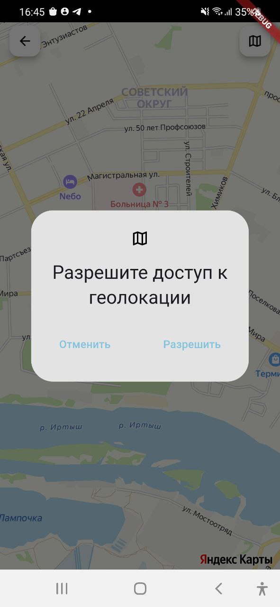
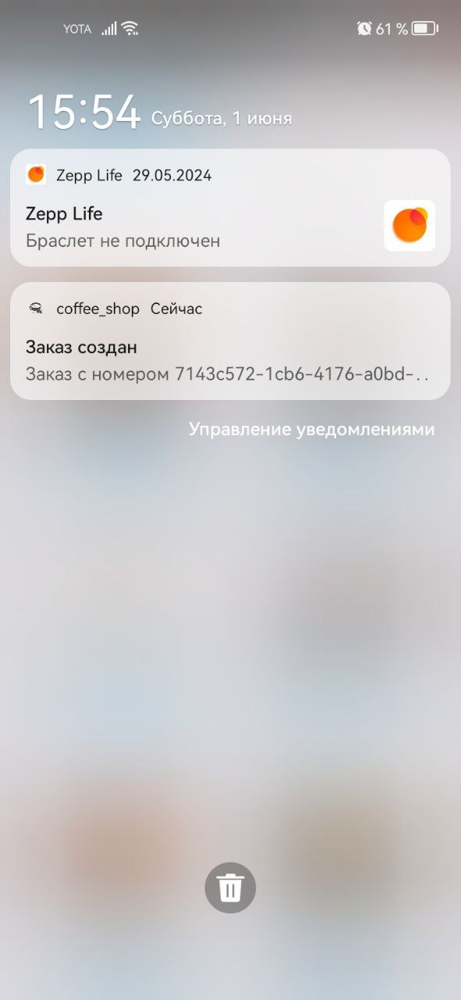

# coffee_shop

## Общая информация

Проект созданный с помощью Flutter, представляющий собой приложение для кофейни. С помощью данного приложения можно выбрать различное кофе, добавить в корзину и сформировать заказ. Также имеется экран с картой, отображающей кофейни и их расположение с возможностью выбора какой-либо локации. Реализована пагинация при взаимодействии с backend. Помимо этого данные для приложения сохраняются в базу данных для возможности использования приложения в офлайн режиме.

## Технологии, использованные в разработке

### Основные технологии:

- Flutter: 3.19.5
- Dart: 3.3.3

### Используемые пакеты:
- http: 1.2.1
- flutter_bloc: 8.1.4
- drift: 2.16.0
- firebase_core: 2.31.0
- firebase_messaging: 14.9.2
- flutter_local_notifications: 17.1.2
- shared_preferences: 2.2.3
- sqlite3: 2.4.1+1
- yandex_mapkit: 4.0.2

## Шаги для запуска проекта

1. Склонировать репозиторий с помощью git clone https://github.com/Nailloon/Coffee_Shop_Flutter.git или скачать архив. **Путь к папке с проектом должен содержать только латинские символы**
2. Выбрать последнюю ветку, на данный момент это lab-6_end_of_work
3. Ввести команду flutter pub get, чтобы подтянуть зависимости
4. Также для запуска необходимо использовать **API_KEY**, используемый для яндекс карт и добавить файл **google-services.json** по следующему пути: /adroid/app. Все данные для запуска готов предоставить по необходимости
5. flutter run --dart-define API_KEY="API_KEY", API_KEY в кавычках заменить на API_KEY, предоставляемый яндексом для использования карт

## Скриншоты работы

Ниже представлены скриншоты с моего устройства Honor 20 Pro:

Далее представлены скриншоты верстки c планшета Lenovo TB-X704L:

В конце показана локализация на английский язык:

